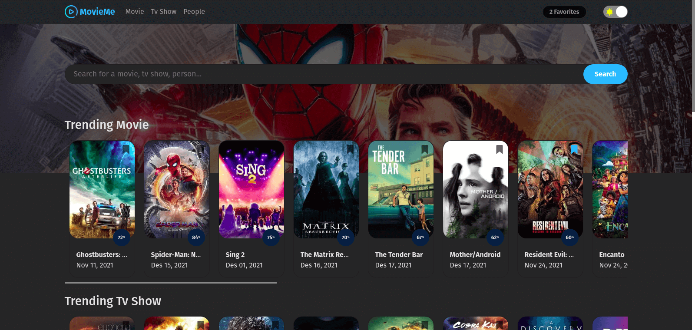
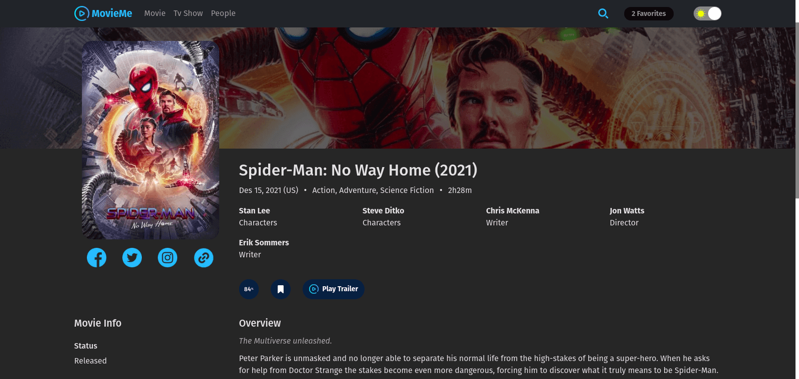
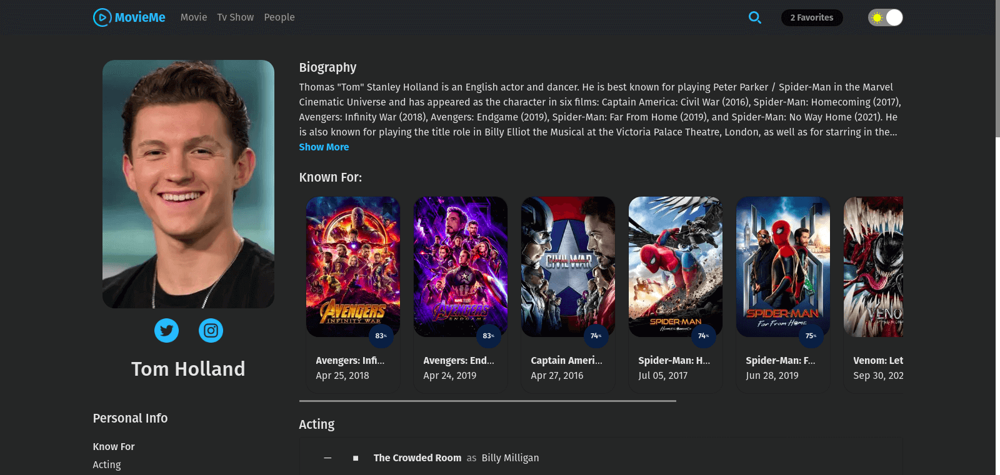

# MovieMe

This app show movie, tv show, and populer people in entertainment, you can check detail for each content, search for content, and save your favorite movie or tv show. The data is provided by [Themoviedb](https://www.themoviedb.org/). You can check the deployed app on [MovieMe](http://movieme.vercel.app/).

## Preview


  



## Build Setup
In the project directory, you can run:

``` bash
# Runs next dev which starts Next.js in development mode
npm run dev

# Runs next build which builds the application for production usage
npm run build

# Runs next start which starts a Next.js production server
npm run start

# Runs next lint which sets up Next.js' built-in ESLint configuration
npm run lint
```

## Technologies
This project uses several technologies listed below :

- **[NextJs](https://nextjs.org/docs)**, the React Framework for Production.
- **[Typescript](https://www.typescriptlang.org/)**, a strict syntactical superset of JavaScript and adds optional static typing to the language.
- **[React Context](https://reactjs.org/docs/context.html)**, context lets you “broadcast” such data, and changes to it, to all components below.
- **[Axios](https://axios-http.com/docs/intro)**, is a promise-based HTTP Client for node.js and the browser.
- **[React Bootstrap](https://react-bootstrap.github.io/)**, bootstrap components built with React.